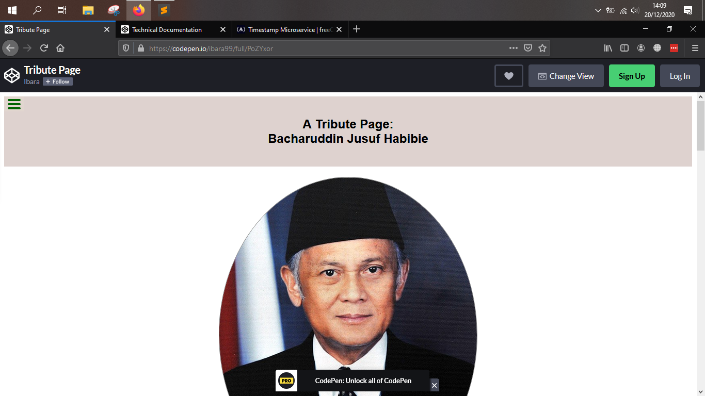
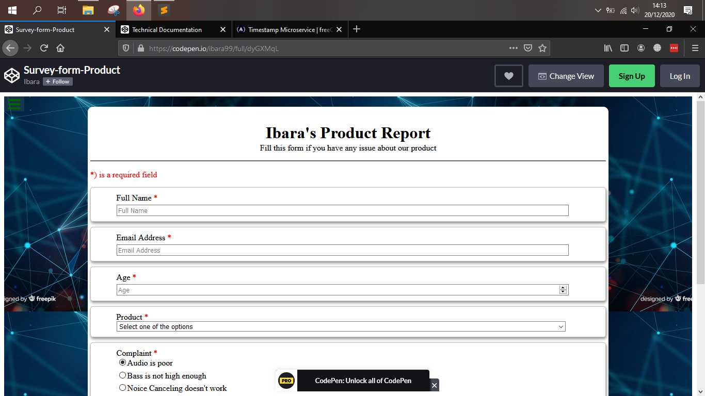
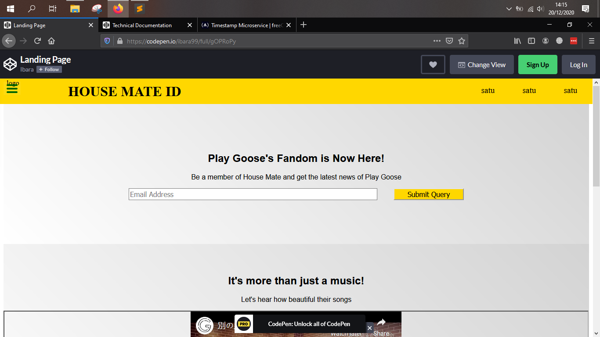
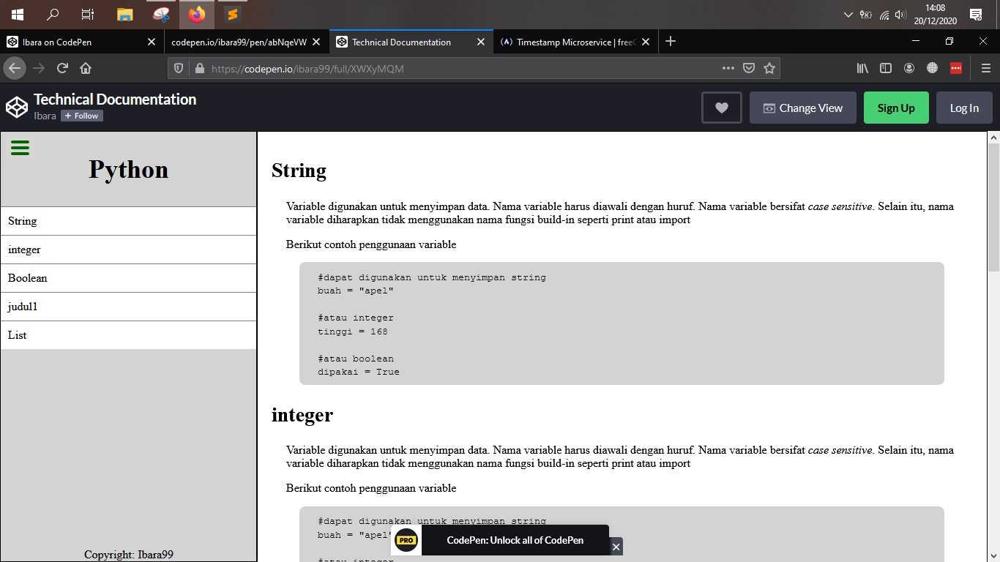
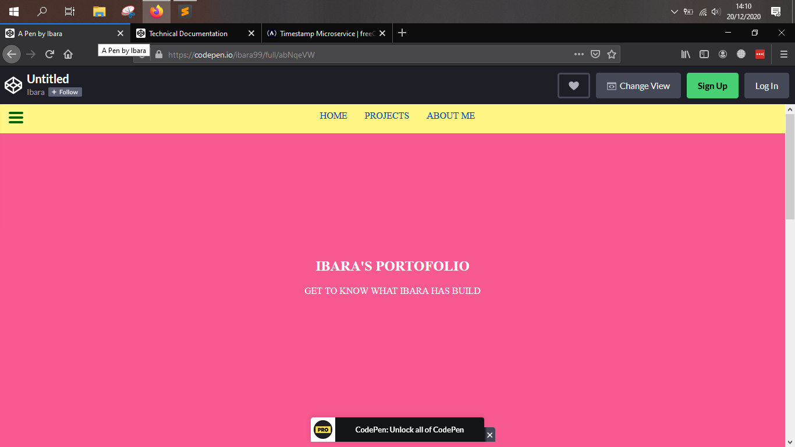
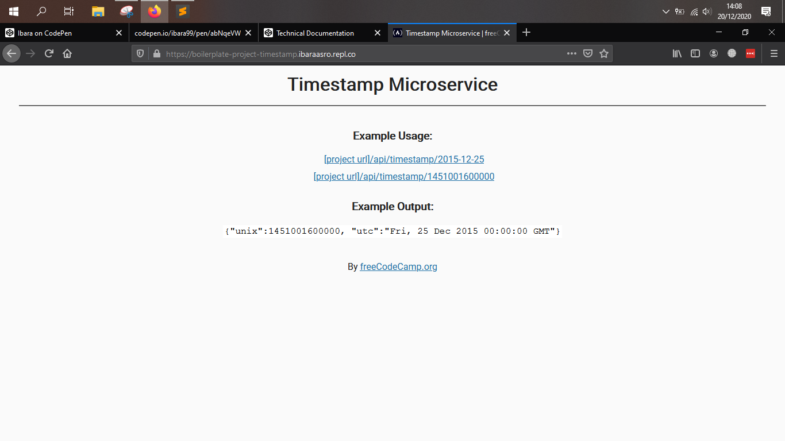
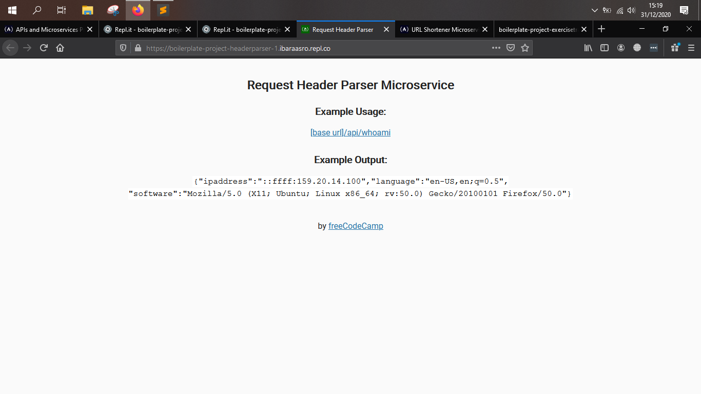
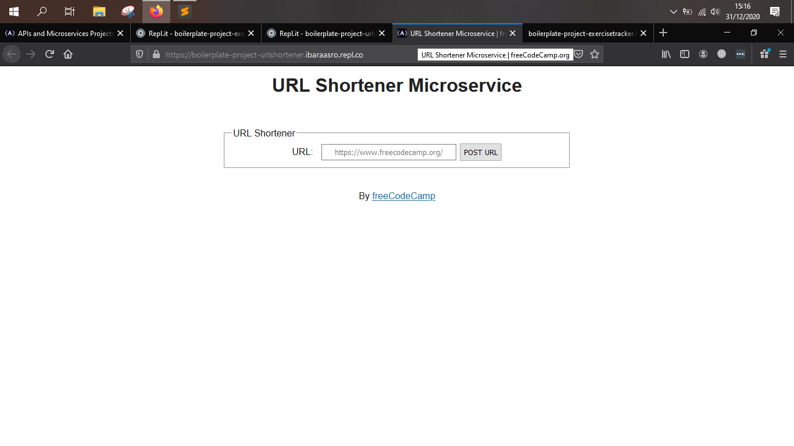

# freecodecamp_projects
Hasil projek saya pada tugas projek Freecodecamp. Repositori ini hanya sebagai portofolio. Untuk detail kriteria penilaian projek, <a href="https://freecodecamp.com/learn">lihat di sini</a>. Berikut beberapa projek yang sudah saya kerjakan:

### Responsive Web App

1. <a href="https://codepen.io/ibara99/full/PoZYxor">Tribute page</a>

2. <a href="https://codepen.io/ibara99/full/dyGXMqL">A survey form</a>

3. <a href="https://codepen.io/ibara99/full/gOPRoPy">Product Landing</a>

4. <a href="https://codepen.io/ibara99/full/XWXyMQM">Technical Documentation</a>

5. <a href="https://codepen.io/ibara99/full/abNqeVW">Personal Portofolio Page</a>

### Microservice app

1. <a href="https://boilerplate-project-timestamp.ibaraasro.repl.co/">Timestamp</a>

2. <a href="https://boilerplate-project-headerparser-1.ibaraasro.repl.co">Request Header Parser Microservice</a>

3. <a href="https://boilerplate-project-urlshortener.ibaraasro.repl.co/">URL Shortener Microservice</a>

4. Exercise Tracker

5. File Metadata Microservice

6. **Bonus :** <a href="https://HappyTastyDifference-1.ibaraasro.repl.co">Tutorial MongoDb dan Mongoose pada Freecodecamp</a>